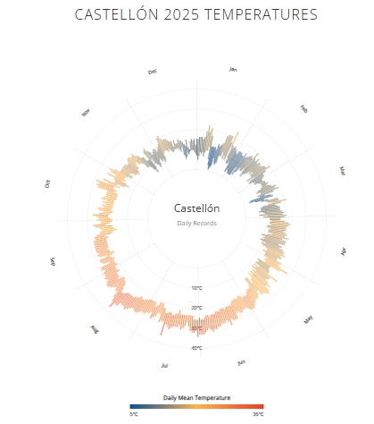

# Castellón 2025 Temperature Visualization

An interactive radial visualization of daily temperatures in **Castellón, Spain**, throughout 2025.

The visualization represents the daily minimum and maximum temperatures using radial bars arranged around a circular year. The color of each bar represents the daily mean temperature, creating a visual overview of how temperatures changed throughout the year.

## Preview



## Features

* Circular visualization of the 2025 calendar year
* Daily minimum and maximum temperatures
* Color encoding based on daily mean temperature
* Monthly separators and labels
* Interactive tooltips with detailed daily temperature information
* Temperature scale from 0°C to 40°C
* Responsive data-driven visualization using D3.js

## Technologies

* HTML5
* CSS3
* JavaScript
* D3.js
* World Weather Online API

## Data

Weather data is retrieved from the **World Weather Online API** using historical weather data for Castellón, Spain.

The API key is intentionally not included in this repository.

To run the project with your own API key, open `index.html` and replace:

```javascript
var API_KEY = 'YOUR_API_KEY_HERE';
```

with your own World Weather Online API key.

## How to Run

1. Clone or download this repository.
2. Open `index.html`.
3. Add your own World Weather Online API key.
4. Open the page in a web browser.
5. Hover over the daily temperature bars to explore the data.

For the best development experience, the project can also be opened using a local development server such as the Live Server extension in Visual Studio Code.

## Visualization

Each radial line represents one day of the year:

* The inner end represents the **minimum temperature**.
* The outer end represents the **maximum temperature**.
* The line color represents the **daily mean temperature**.
* The circular layout follows the progression of the year from January through December.

Hovering over a daily bar displays the corresponding date, minimum temperature, maximum temperature, and mean temperature.

## Purpose

This project was created to explore data visualization techniques using D3.js and to present historical temperature data in an interactive and visually intuitive format.

